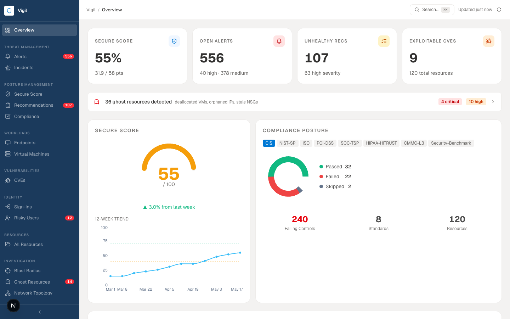
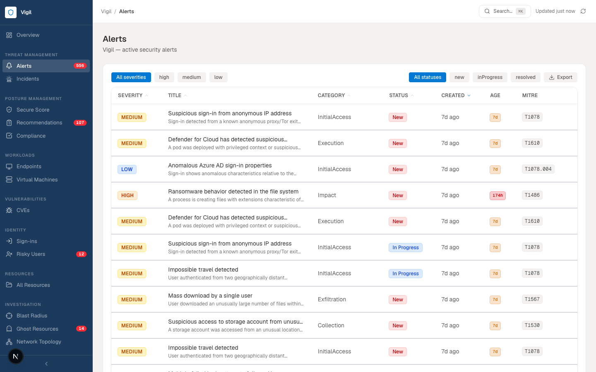
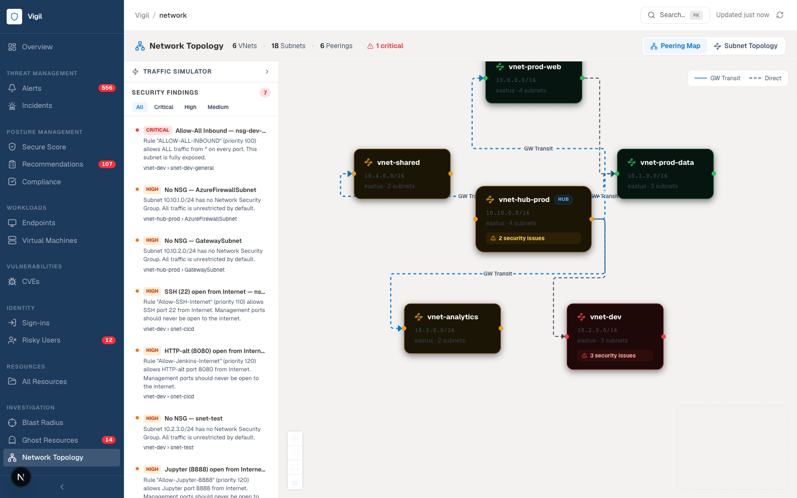
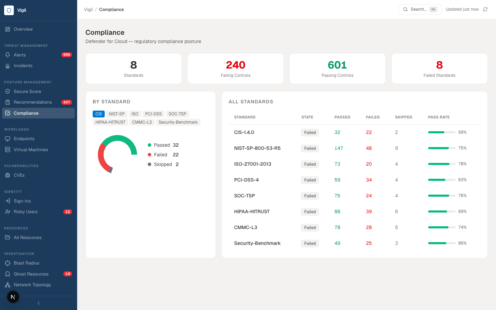
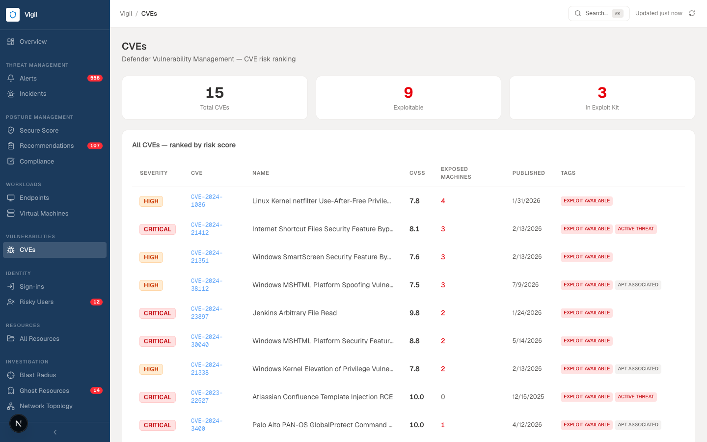
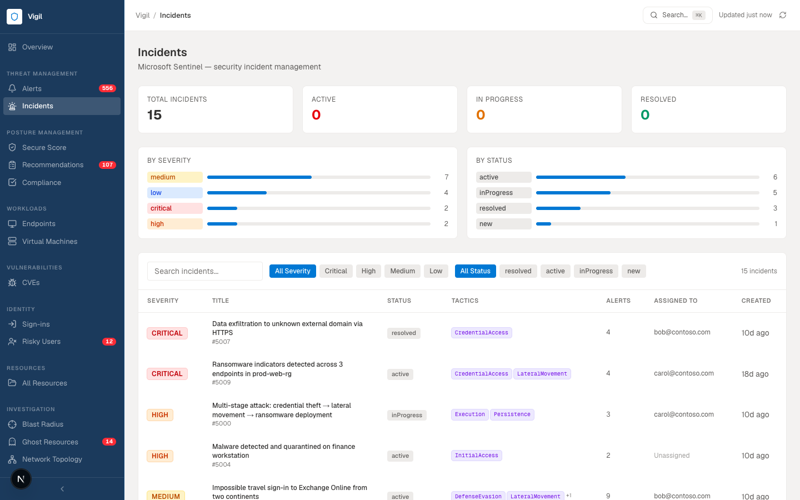

<div align="center">



# Vigil

**Azure Security Posture Dashboard**

A single-pane-of-glass security operations dashboard for Microsoft Azure — real-time alerts, compliance posture, identity risk, network topology, and threat investigation in one place.


</div>

---

## What is Vigil?

Vigil pulls security data from **Microsoft Defender for Cloud**, **Microsoft Graph Security**, and **Azure Resource Graph** and presents it in a clean, Azure Portal–styled dashboard — designed for security engineers and cloud operators who need situational awareness fast.

- No clicking through 10 Azure Portal blades to understand your posture
- All data surfaced in one place: alerts, CVEs, compliance controls, sign-in risk, network exposure, ghost resources
- Runs against **Azure SQL Database** (production) or **built-in mock data** (zero-config local dev)

---

## Pages

<table>
  <tr>
    <td><b>Overview</b><br/>Secure score, MITRE heatmap, compliance donut, top alerts</td>
    <td><b>Alerts</b><br/>556 alerts, sortable by severity/date, MITRE ATT&CK column</td>
  </tr>
  <tr>
    <td></td>
    <td></td>
  </tr>
  <tr>
    <td><b>Network Topology</b><br/>VNet peering map, NSG inspector, traffic simulator</td>
    <td><b>Compliance</b><br/>CIS, NIST, ISO 27001, PCI-DSS, SOC 2, HIPAA and more</td>
  </tr>
  <tr>
    <td></td>
    <td></td>
  </tr>
  <tr>
    <td><b>CVEs</b><br/>Risk-ranked vulnerabilities, CVSS scores, exploit/ransomware tags</td>
    <td><b>Incidents</b><br/>Sentinel incidents, tactic chains, severity breakdown</td>
  </tr>
  <tr>
    <td></td>
    <td></td>
  </tr>
</table>

---

## Feature List

| Area | Features |
|------|----------|
| **Dashboard** | Secure score gauge + delta, 12-week trend line, compliance donut, MITRE ATT&CK heatmap, sign-in risk summary, ghost resource callout |
| **Alerts** | Paginated · sortable · filterable by severity/status/category · MITRE technique tags · full detail drill-down |
| **Recommendations** | Severity-ranked · filterable by category · effort/impact metadata |
| **CVEs** | CVSS v3 scores · exposed machine counts · CISA KEV exploit tags · ransomware/APT threat tags |
| **Compliance** | 8 standards (CIS 1.4, NIST 800-53, ISO 27001, PCI-DSS 4.0, SOC 2, HIPAA-HITRUST, CMMC-L3, Security Benchmark) · pass/fail/skipped breakdown |
| **Identity Risk** | Sign-in log · risk level · failed logins · top risky IPs · geography map · risky users |
| **Network Topology** | Interactive VNet peering map · subnet topology · NSG rule inspector · per-rule Allow/Deny badges · traffic simulator |
| **Ghost Resources** | Detects deallocated VMs, orphaned public IPs, stale NSGs, abandoned storage · risk scoring · remediation steps |
| **Blast Radius** | Force-directed graph showing attack propagation from any compromised resource |
| **Incidents** | Sentinel incident list · severity/status/tactic breakdown · related alerts |
| **Scenario Switcher** | Hot-swap between noisy / compromised / secured mock scenarios without restarting |

---

## Tech Stack

| Layer | Technologies |
|-------|-------------|
| **Backend** | Python 3.11 · FastAPI · pyodbc · pydantic-settings · uvicorn |
| **Database** | Azure SQL Database (any service tier) |
| **Frontend** | Next.js 14 App Router · TypeScript · Tailwind CSS v4 · Recharts · React Flow · Lucide React |
| **Auth** | Azure `DefaultAzureCredential` (Managed Identity / `az login`) |

---

## Getting Started

### Prerequisites

| Tool | Version | Notes |
|------|---------|-------|
| Python | 3.11+ | `python3 --version` |
| Node.js | 18+ | `node --version` |
| ODBC Driver 18 | latest | [Download here](https://learn.microsoft.com/sql/connect/odbc/download-odbc-driver-for-sql-server) |
| Azure SQL Database | any tier | Basic ($5/mo) works fine |

---

### Option A — With Azure SQL (recommended)

#### 1. Clone

```bash
git clone https://github.com/Ahmadabasss/CSDash.git
cd CSDash
```

#### 2. Create the database tables

Run `backend/scripts/create_schema.sql` against your database. It is **idempotent** — safe to run multiple times.

```bash
# using sqlcmd
sqlcmd -S YOUR_SERVER.database.windows.net -d YOUR_DATABASE \
       -U YOUR_USERNAME -P YOUR_PASSWORD \
       -i backend/scripts/create_schema.sql
```

Or open the file in **Azure Data Studio** and click **Run**.

#### 3. Seed the database

```bash
pip install pyodbc

python backend/scripts/seed_sql.py \
  --conn "Driver={ODBC Driver 18 for SQL Server};Server=tcp:YOUR_SERVER.database.windows.net,1433;Database=YOUR_DATABASE;Uid=YOUR_USERNAME;Pwd=YOUR_PASSWORD;Encrypt=yes;TrustServerCertificate=no;Connection Timeout=30;" \
  --scenario noisy
```

> Available scenarios: `noisy` (default) · `compromised` · `secured`

#### 4. Configure the backend

```bash
cd backend
cp .env.example .env
```

Edit `.env` — paste your connection string on one line:

```env
DATA_SOURCE=sql
SQL_CONNECTION_STRING=Driver={ODBC Driver 18 for SQL Server};Server=tcp:YOUR_SERVER.database.windows.net,1433;Database=YOUR_DATABASE;Uid=YOUR_USERNAME;Pwd=YOUR_PASSWORD;Encrypt=yes;TrustServerCertificate=no;Connection Timeout=30;
FRONTEND_ORIGIN=http://localhost:3000
```

> **Where to find your connection string:**
> Azure Portal → your SQL Database → **Settings → Connection strings → ODBC tab**
> Copy the string and replace `{your_password}` with your actual password.

#### 5. Start the backend

```bash
cd backend
python3 -m venv .venv && source .venv/bin/activate
# Windows: .venv\Scripts\activate
pip install -r requirements.txt
uvicorn app.main:app --reload --port 8000
```

✅ API docs: **http://localhost:8000/docs**

#### 6. Start the frontend

```bash
cd frontend
cp .env.example .env.local
npm install
npm run dev
```

✅ Dashboard: **http://localhost:3000**

---

### Option B — Mock mode (no database, zero config)

No Azure account needed. Runs entirely on local JSON files.

```bash
# 1. backend/.env
DATA_SOURCE=mock

# 2. start backend
cd backend
python3 -m venv .venv && source .venv/bin/activate
pip install -r requirements.txt
uvicorn app.main:app --reload --port 8000

# 3. start frontend
cd frontend && npm install && npm run dev
```

**Switch scenarios at runtime** — no restart needed:

```bash
# Active attack in progress
curl -X POST http://localhost:8000/api/scenario \
     -H "Content-Type: application/json" \
     -d '{"scenario": "compromised"}'

# Hardened tenant
curl -X POST http://localhost:8000/api/scenario \
     -d '{"scenario": "secured"}'
```

| Scenario | Secure Score | Alerts | Story |
|----------|-------------|--------|-------|
| `noisy` | 55% | 556 | Typical enterprise — realistic day-to-day noise |
| `compromised` | 32% | 600 high-sev | Active attack in progress — lateral movement, ransomware indicators |
| `secured` | 78% | 80 | Well-hardened tenant — minimal exposure |

---

## Configuration Reference

### `backend/.env`

| Variable | Default | Description |
|----------|---------|-------------|
| `DATA_SOURCE` | `sql` | `sql` — Azure SQL Database · `mock` — local JSON files |
| `SQL_CONNECTION_STRING` | — | Full ODBC string from Azure Portal (required when `DATA_SOURCE=sql`) |
| `FRONTEND_ORIGIN` | `http://localhost:3000` | CORS allowed origin — change when deploying frontend |

### `frontend/.env.local`

| Variable | Default | Description |
|----------|---------|-------------|
| `NEXT_PUBLIC_API_URL` | `http://localhost:8000` | Backend URL — update when deploying |

---

## Project Structure

```
CSDash/
├── backend/
│   ├── app/
│   │   ├── main.py              # FastAPI app, CORS, lifespan task
│   │   ├── config.py            # All settings via pydantic-settings
│   │   ├── deps.py              # DataSource singleton + scenario switcher
│   │   ├── services/
│   │   │   ├── base.py          # DataSource Protocol (structural typing)
│   │   │   ├── sql.py           # Azure SQL — async pyodbc via asyncio.to_thread
│   │   │   └── mock.py          # Local JSON — hot-reloadable
│   │   └── routers/             # alerts · recommendations · vulnerabilities
│   │                            # compliance · resources · signins · incidents
│   │                            # network · orphans · blast_radius · ...
│   ├── scripts/
│   │   ├── create_schema.sql    # Idempotent T-SQL DDL for all 12 tables
│   │   └── seed_sql.py          # Seeds any scenario into Azure SQL
│   └── mock_data/               # Network topology source JSON
├── frontend/
│   ├── app/                     # Next.js 14 App Router pages
│   ├── components/              # Reusable UI components (charts, tables, badges)
│   ├── lib/api.ts               # Typed fetch helper
│   └── types/azure.ts           # TypeScript interfaces matching API shapes
└── data/
    └── big-mock-data/scenarios/ # noisy · compromised · secured scenario data
```

---

## API Reference

| Method | Endpoint | Description |
|--------|----------|-------------|
| `GET` | `/health` | Health check |
| `GET` | `/api/summary` | All dashboard card counts in one call |
| `GET` | `/api/secure-score` | Current score + 12-week history |
| `GET` | `/api/alerts` | Paginated alerts — `?page=1&limit=50&sort=severity&order=desc` |
| `GET` | `/api/alerts/{id}` | Single alert detail |
| `GET` | `/api/alerts/mitre-summary` | Technique frequency for MITRE heatmap |
| `GET` | `/api/recommendations` | Paginated recommendations |
| `GET` | `/api/recommendations/{id}` | Single recommendation detail |
| `GET` | `/api/vulnerabilities` | CVE list ranked by risk score |
| `GET` | `/api/compliance` | All regulatory standards posture |
| `GET` | `/api/resources` | Azure resource inventory |
| `GET` | `/api/resources/{id}` | Resource detail with related alerts & recommendations |
| `GET` | `/api/signins` | Sign-in logs |
| `GET` | `/api/signins/risk-summary` | Risky IPs, countries, risk level breakdown |
| `GET` | `/api/incidents` | Security incidents |
| `GET` | `/api/network/topology` | VNet topology with NSG details merged |
| `GET` | `/api/orphans` | Abandoned/ghost resources |
| `GET` | `/api/scenario` | Current active scenario |
| `POST` | `/api/scenario` | Hot-swap scenario `{"scenario": "compromised"}` |

Interactive docs available at **http://localhost:8000/docs** when the backend is running.

---

## Troubleshooting

**`pyodbc.Error: [08001]` — Can't connect to SQL Server**
- Make sure ODBC Driver 18 for SQL Server is installed: [Download](https://learn.microsoft.com/sql/connect/odbc/download-odbc-driver-for-sql-server)
- Check your server name — it should end in `.database.windows.net`
- Verify your IP is allowed in the Azure SQL firewall: Azure Portal → SQL Server → **Networking → Firewall rules**

**`ValueError: SQL_CONNECTION_STRING is not set`**
- You copied `.env.example` but haven't filled in the connection string yet
- Make sure `DATA_SOURCE=sql` and `SQL_CONNECTION_STRING=...` are both in `backend/.env`

**Frontend shows "Backend offline"**
- Start the FastAPI backend first: `uvicorn app.main:app --reload --port 8000`
- Check `NEXT_PUBLIC_API_URL` in `frontend/.env.local` matches the backend port

**Tables are empty after seeding**
- Make sure `create_schema.sql` ran successfully before `seed_sql.py`
- Check the seed output — it prints a row count per table

---

## License

MIT
